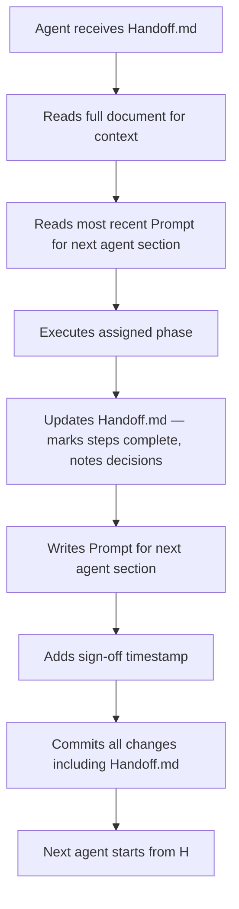

# Architecture

## Overview

The LED Simulator is a browser-based tool for designing and previewing LED strip effects without hardware. It is a companion to the [bt-led-controller](https://github.com/AatozInnoInc/bt-led-controller) Arduino project.

The central architectural decision is that the simulator does not invent its own protocol or abstraction. It mimics the exact binary BLE command protocol used by the companion React Native app. The simulator's "device" is a TypeScript port of the Arduino state machine in `bt-led-controller.ino`.

This means:
- Effects developed in the simulator can be copy-pasted into the firmware with confidence they will behave identically.
- The simulator exercises the same code paths the real app uses, making it a protocol-level integration test.
- Presets exported from the simulator are in the same format the companion RN app expects to import.

---

## Repository structure

See `charts/repository-structure.md` for the full diagram.

The simulator lives in `apps/simulator/` inside the bt-led-controller monorepo. Shared logic lives in workspace packages:

- `packages/led-engine/` — TypeScript port of the C++ math helpers, all pattern functions, and the VirtualDevice state machine. No browser or framework dependencies. Shared with the companion RN app if it ever builds a preview feature.
- `packages/ble-protocol/` — BLE command constants (`CMD_*`, `RESPONSE_*`, `ERROR_*`) matching `device_config.h` exactly. Single source of truth for both the simulator and the RN app.
- `packages/led-types/` — `LedPreset`, `LedConfig`, `ExportEnvelope`, `PatternId`, `PatternFn`. Shared between both apps so preset format changes propagate automatically.

The simulator's `src/` directory contains only what is specific to the browser app:
- `engine/BleCommandService.ts` — the mock BLE transport (the RN app has its own real transport)
- `engine/CodeGenerator.ts` — Arduino C++ output (RN app has no use for this)
- `hooks/`, `components/`, `styles/`

See `charts/system-architecture.md` and `charts/repository-structure.md` for the full diagrams.

### Shared packages (`packages/`)

Logic shared between the simulator and the companion RN app lives in workspace packages with no browser or framework dependencies.

`packages/led-engine/` — `VirtualDevice`, `PatternRunner`, and `math.ts`. The math helpers are a 1:1 TypeScript port of the C++ functions in `bt-led-controller.ino`. The port is intentionally faithful: behavioral parity with the firmware is the correctness requirement, not TypeScript idiom. This package is testable in Node with no DOM.

`packages/ble-protocol/` — All `CMD_*`, `RESPONSE_*`, and `ERROR_*` constants, values matching `device_config.h` exactly. Single source of truth for both apps.

`packages/led-types/` — `LedPreset`, `LedConfig`, `ExportEnvelope`, `PatternId`, `PatternFn`. Shared so a preset format change propagates to both apps in one commit.

### Simulator app (`apps/simulator/`)

Contains only what is specific to the browser:

`BleCommandService` — the mock BLE transport. Instead of writing to a BLE UART characteristic, it passes binary `Uint8Array` messages to `VirtualDevice.processCommand()`. The transport is a seam: swapping it for a real Web Bluetooth adapter in a future build requires changing only this file.

`CodeGenerator` — renders a C++ function body for the current preset, using only helpers already present in `bt-led-controller.ino`. The RN app has no use for this.

`hooks/`, `components/` — React layer. The `usePatternLoop` hook drives the `requestAnimationFrame` loop, calling `VirtualDevice.tick()` gated at 30 fps to match `LED_UPDATE_INTERVAL_MS 33` in the firmware.

### Output

Two outputs from the simulator:

1. Arduino C++ snippet — `CodeGenerator` output, pasted directly into `bt-led-controller.ino`.
2. Preset JSON — `ExportEnvelope` from `packages/led-types/`, imported by the companion RN app. See `charts/data-model.md`.

---

## Tech stack

| Concern | Choice | Reason |
|---|---|---|
| Framework | React 18 + Vite + TypeScript | Lightweight, fast dev server, easy Vercel deploy |
| Styling | Tailwind CSS | Consistent with companion RN app toolchain |
| Animation | `requestAnimationFrame` (no library) | Mirrors the Arduino `loop()` tick directly |
| Storage | `localStorage` + JSON file export | No backend required for v1 |
| Hosting | Vercel | Zero-config deploy, free tier, preview per PR |
| Shared presets (v1.5) | Supabase | Adds a public gallery without changing the core |

---

## Key constraints

- The engine (`src/engine/`) has zero React dependencies. It can run in a Node test environment with no DOM.
- Math helpers are 1:1 ports. They are not "improved" — identical behaviour is the goal.
- The mock BLE transport is a seam, not a mock framework. It is the real production code path for the simulator; it just happens to be in-process.
- Pattern functions are pure: they receive `(buf, cfg, now)` and write to `buf`. No side effects, no module-level state (except the `fire` effect's heat array, which lives in a closure scoped to a single device instance).

---

## Decision log

| Decision | Alternatives considered | Reason chosen |
|---|---|---|
| Simulator as `apps/simulator/` in bt-led-controller monorepo | Separate repository | Repo already uses npm; shared packages eliminate type/constant duplication with the RN app; single PR can touch firmware, simulator, and RN app together |
| Shared `packages/led-engine/`, `ble-protocol/`, `led-types/` | Duplicate types per app | Single source of truth for BLE constants and preset format; RN app picks up changes automatically |
| React + Vite over Expo/RN Web | Expo Web, plain HTML canvas | No native device APIs needed; simpler deploy; faster iteration |
| Mirror BLE protocol over direct buffer access | Direct pixel writes, custom API | Protocol parity means the simulator validates the real integration path |
| Math helpers are 1:1 ports (no "improvement") | Idiomatic TypeScript rewrites | Behavioral parity with the firmware is the correctness requirement; divergence means the simulator lies |
| Preset export in RN format via shared `led-types` package | Custom format, .ino config file | Single type definition consumed by both apps; no translation step |
| `requestAnimationFrame` gated at 30 fps | 60 fps, `setInterval` | Matches `LED_UPDATE_INTERVAL_MS 33` in firmware; consistent timing |
| SVG circles with layered opacity for LED render | WebGL, Canvas 2D, CSS drop-shadow | No build deps; no CSS filter performance issues on wide strips; scales cleanly |
| Supabase for shared gallery (v1.5) | Firebase, custom API | Already likely in the main app ecosystem; simple row-level security |

---

## Agent handoff workflow

This project uses Claude Code agents to execute development work. The handoff document (`Handoff.md`) is the source of truth for what has been done and what comes next.

### Rules

- Each agent appends to `Handoff.md` — previous sections are never removed or edited
- Sign-off format: `Completed by: [agent or role] — [ISO 8601 datetime]`
- No agent starts Phase N+1 work until Phase N tests are passing
- Any deviation from the plan (different library, different approach) is noted inline in the relevant Handoff.md step before the sign-off
- The agent workflow rule itself is included by reference in every "Prompt for next agent" section, so it propagates forward without being re-written each time
