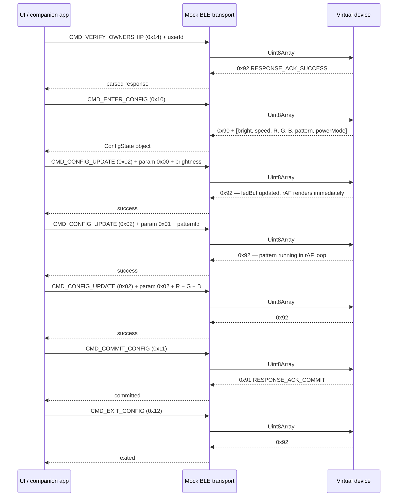

# BLE protocol

Mirrors the binary protocol in `bt-led-controller.ino` exactly.
All command bytes, param bytes, and response codes are identical to the firmware.

## Command flow

## Command byte reference

| Constant | Value | Payload |
|---|---|---|
| CMD_STATUS | 0x00 | none |
| CMD_CONFIG_UPDATE | 0x02 | param byte + value bytes |
| CMD_ENTER_CONFIG | 0x10 | none |
| CMD_COMMIT_CONFIG | 0x11 | none |
| CMD_EXIT_CONFIG | 0x12 | none |
| CMD_CLAIM_DEVICE | 0x13 | len(1) + userId bytes |
| CMD_VERIFY_OWNERSHIP | 0x14 | len(1) + userId bytes |
| CMD_UNCLAIM_DEVICE | 0x15 | len(1) + userId bytes |
| CMD_REQUEST_ANALYTICS | 0x20 | none |
| CMD_CONFIRM_ANALYTICS | 0x21 | none |

## Config update param byte reference

| Param | Value | Payload |
|---|---|---|
| Brightness | 0x00 | 1 byte (0–255) |
| Pattern | 0x01 | 1 byte (0–9) |
| Color RGB | 0x02 | 3 bytes (R, G, B) |
| Power mode | 0x03 | 1 byte (0–2) |
| Speed | 0x04 | 1 byte (0–100) |

## Response byte reference

| Constant | Value | Notes |
|---|---|---|
| RESPONSE_ACK_CONFIG_MODE | 0x90 | First byte of 8-byte config response |
| RESPONSE_ACK_COMMIT | 0x91 | Config committed to flash (simulated) |
| RESPONSE_ACK_SUCCESS | 0x92 | General success |
| RESPONSE_ANALYTICS_BATCH | 0xA0 | Analytics payload |
| Error envelope | 0x90 + errorCode + message | Error byte is errorCode, not 0x90 on its own |
