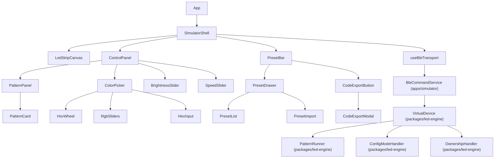

# Component hierarchy

## Hook responsibilities

| Hook | Responsibility |
|---|---|
| `useBleTransport` | Wraps BleCommandService, exposes typed send/receive, manages connection state |
| `useDeviceConfig` | Sends CMD_CONFIG_UPDATE commands, tracks local mirror of currentSettings |
| `usePatternLoop` | Runs rAF loop against VirtualDevice.tick(), feeds pixels to LedStripCanvas |
| `usePresets` | localStorage CRUD + file import/export in RN-compatible format |
