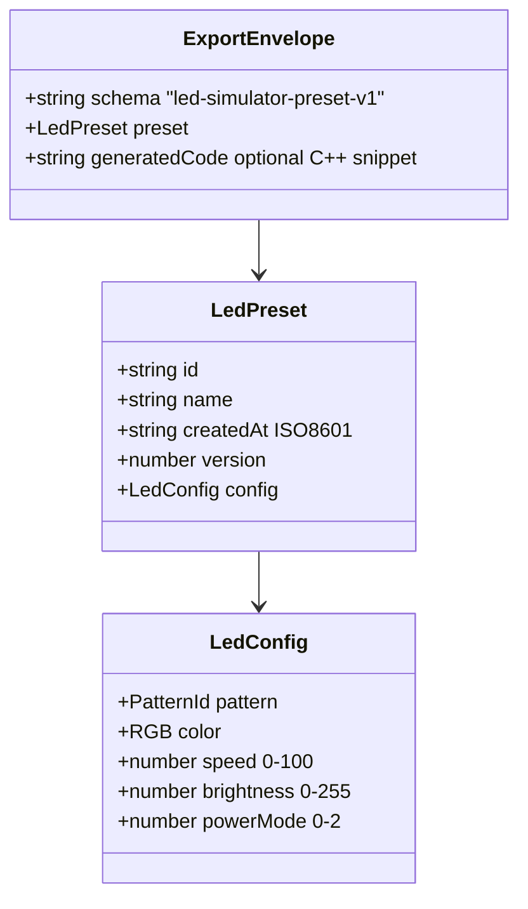
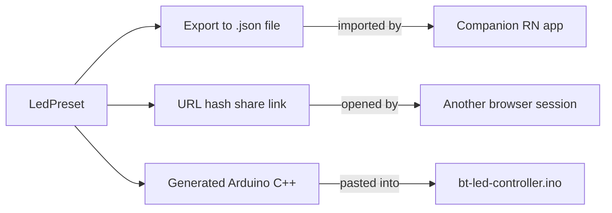

# Data model

## Preset and config types

## Export destinations

## PatternId values

These map 1:1 to the PATTERN_* constants in `device_config.h`:

| PatternId | .ino constant | Value |
|---|---|---|
| off | PATTERN_OFF | 0 |
| solid | PATTERN_SOLID_WHITE | 1 |
| rainbow | PATTERN_RAINBOW | 2 |
| pulse | PATTERN_PULSE | 3 |
| fade | PATTERN_FADE | 4 |
| chase | PATTERN_CHASE | 5 |
| twinkle | PATTERN_TWINKLE | 6 |
| wave | PATTERN_WAVE | 7 |
| breath | PATTERN_BREATH | 8 |
| strobe | PATTERN_STROBE | 9 |
| fire | (new, add to .ino) | 10 |
