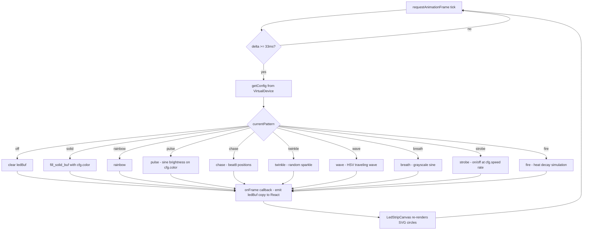

# Pattern animation loop

Mirrors the `loop()` → `updatePattern()` → `showLeds()` cycle in `bt-led-controller.ino`.
The 30 fps gate matches `LED_UPDATE_INTERVAL_MS 33` in the firmware.

## Math helpers — 1:1 port from .ino

| C++ | TypeScript | Purpose |
|---|---|---|
| `sin8_approx(x)` | `sin8(x)` | 0–255 sine, 0–255 input |
| `hsv2rgb(h,s,v)` | `hsv2rgb(h,s,v)` | HSV to RGB, 0–255 all |
| `rgb2hsv(r,g,b)` | `rgb2hsv(r,g,b)` | RGB to HSV, 0–255 all |
| `beat8_like(bpm, phase)` | `beat8(bpm, phase, now)` | 0–255 ramp at BPM |
| `qadd8(a,b)` | `qadd8(a,b)` | Saturating add |
| `qsub8(a,b)` | `qsub8(a,b)` | Saturating subtract |
| `fadeToBlackBy_buf(amt)` | `buf.fadeToBlackBy(amt)` | Scale each channel down |
| `blend_rgb(a,b,t)` | `blendRgb(a,b,t)` | Linear RGB blend |
| `gamma8[]` | `GAMMA8[]` | Gamma correction table |
