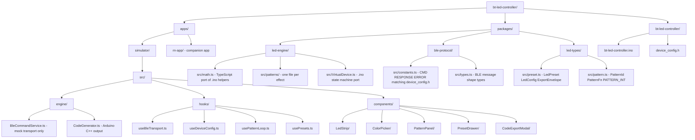

# Repository structure

The simulator lives inside the bt-led-controller monorepo as `apps/simulator/`.
Shared logic lives in workspace packages consumed by both the simulator and the companion RN app.

## Dependency rules

| Package or app | May depend on | May not depend on |
|---|---|---|
| `packages/led-engine` | `led-types`, `ble-protocol` | React, RN, browser APIs, Node APIs |
| `packages/ble-protocol` | nothing | anything |
| `packages/led-types` | `ble-protocol` | anything else |
| `apps/simulator` | all packages, React | React Native |
| `apps/rn-app` | all packages, React Native | browser APIs |

`packages/led-engine` must be testable in Node with Vitest and no DOM.

## What the monorepo eliminates

Without shared packages, both the simulator and the RN app would define their own copies of BLE command constants, preset and pattern types, and math helpers. With shared packages, there is one source of truth. A change to the preset format is made once in `packages/led-types/` and both apps pick it up on the next build.

## What the monorepo does not eliminate

The TypeScript math helpers in `packages/led-engine/src/math.ts` are still a necessary port of the C++ functions in `bt-led-controller.ino`. C++ cannot run in a browser or in React Native. The port is unavoidable. What the monorepo changes is that the port lives once in a shared package rather than being duplicated per app.
