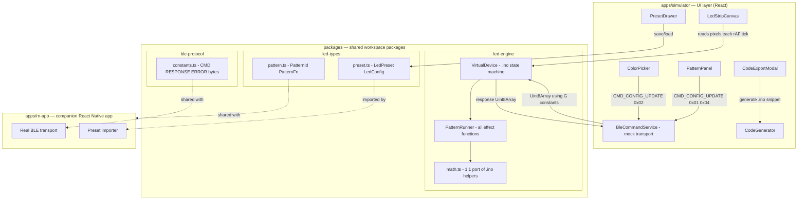

# System architecture

```mermaid
graph TD
    subgraph UI["apps/simulator — UI layer (React)"]
        A[LedStripCanvas]
        B[ColorPicker]
        C[PatternPanel]
        D[PresetDrawer]
        E[CodeExportModal]
        F[BleCommandService - mock transport]
        N[CodeGenerator]
    end

    subgraph Shared["packages — shared workspace packages"]
        subgraph Engine["led-engine"]
            I[VirtualDevice - .ino state machine]
            L[PatternRunner - all effect functions]
            M[math.ts - 1:1 port of .ino helpers]
        end
        subgraph Proto["ble-protocol"]
            G[constants.ts - CMD RESPONSE ERROR bytes]
        end
        subgraph Types["led-types"]
            O[preset.ts - LedPreset LedConfig]
            P[pattern.ts - PatternId PatternFn]
        end
    end

    subgraph RN["apps/rn-app — companion React Native app"]
        Q[Real BLE transport]
        R[Preset importer]
    end

    A -->|reads pixels each rAF tick| I
    B -->|CMD_CONFIG_UPDATE 0x02| F
    C -->|CMD_CONFIG_UPDATE 0x01 0x04| F
    D -->|save/load| O
    E -->|generate .ino snippet| N

    F -->|Uint8Array using G constants| I
    I --> L
    L --> M
    I -->|response Uint8Array| F

    O -.->|imported by| R
    G -.->|shared with| Q
    P -.->|shared with| RN
```
