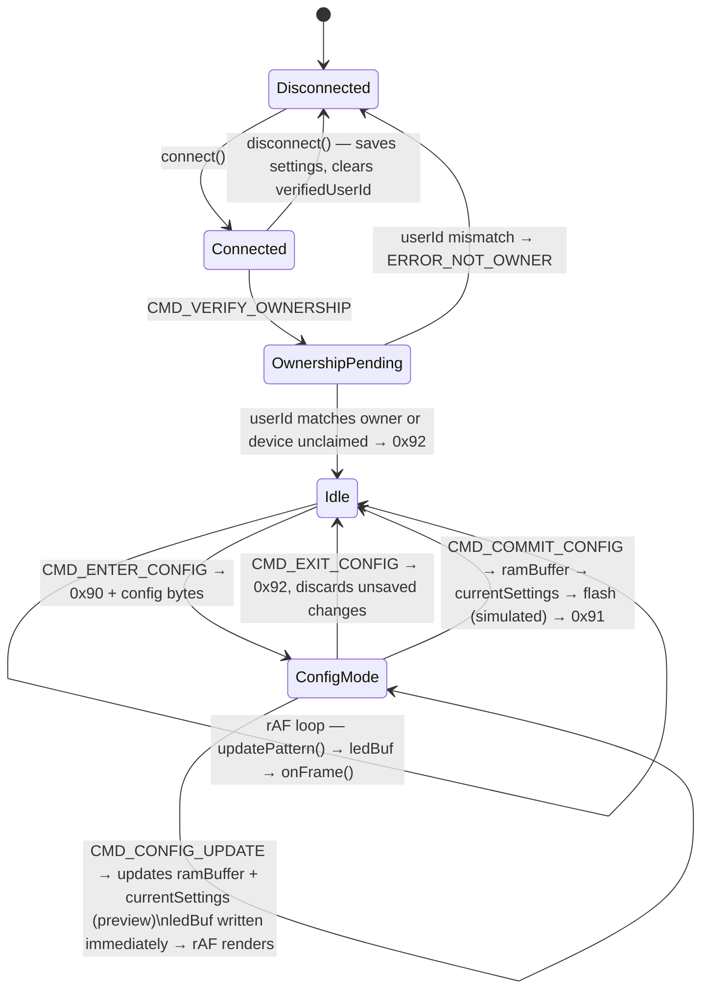
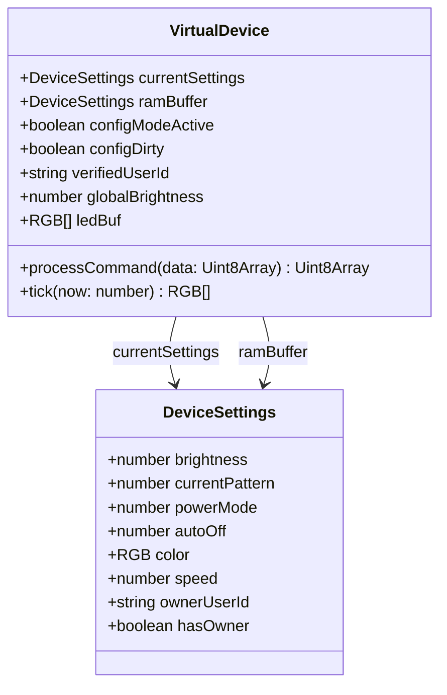

# Virtual device state machine

The virtual device mirrors the state model in `bt-led-controller.ino`.

```mermaid
stateDiagram-v2
    [*] --> Disconnected

    Disconnected --> Connected : connect()
    Connected --> Disconnected : disconnect() — saves settings, clears verifiedUserId

    Connected --> OwnershipPending : CMD_VERIFY_OWNERSHIP
    OwnershipPending --> Idle : userId matches owner or device unclaimed → 0x92
    OwnershipPending --> Disconnected : userId mismatch → ERROR_NOT_OWNER

    Idle --> ConfigMode : CMD_ENTER_CONFIG → 0x90 + config bytes
    ConfigMode --> Idle : CMD_EXIT_CONFIG → 0x92, discards unsaved changes

    ConfigMode --> ConfigMode : CMD_CONFIG_UPDATE → updates ramBuffer + currentSettings (preview)\nledBuf written immediately → rAF renders
    ConfigMode --> Idle : CMD_COMMIT_CONFIG → ramBuffer → currentSettings → flash (simulated) → 0x91

    Idle --> Idle : CMD_STATUS → 0x92
    Idle --> Idle : rAF loop — updatePattern() → ledBuf → onFrame()
```

## Key state variables (mirrors .ino globals)

```mermaid
classDiagram
    class VirtualDevice {
        +DeviceSettings currentSettings
        +DeviceSettings ramBuffer
        +boolean configModeActive
        +boolean configDirty
        +string verifiedUserId
        +number globalBrightness
        +RGB[] ledBuf
        +processCommand(data: Uint8Array) Uint8Array
        +tick(now: number) RGB[]
    }

    class DeviceSettings {
        +number brightness
        +number currentPattern
        +number powerMode
        +number autoOff
        +RGB color
        +number speed
        +string ownerUserId
        +boolean hasOwner
    }

    VirtualDevice --> DeviceSettings : currentSettings
    VirtualDevice --> DeviceSettings : ramBuffer
```
